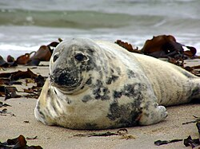

# Grey Seal



*Logo: [Halichoerus grypus He3](https://commons.wikimedia.org/wiki/File:Halichoerus_grypus_He3.jpg) by Andreas Trepte, CC BY-SA 2.5 via Wikimedia Commons*

Grey Seal is a self-hosted Retrieval-Augmented Generation (RAG) chat backend written in Go. It manages **conversations**, **roles** (system prompts), and **resources** (indexed documents), and answers user queries grounded in a knowledge base it indexes itself. At runtime it wires together a PostgreSQL store, an Ollama LLM, and an external vector-search service called **shrike**; the LLM runs locally and the data never leaves the network.

## What It Does

- Streaming chat via a Connect-RPC server-streaming RPC (`Chat`), retrieving relevant context from **shrike** and injecting it into the LLM prompt
- Role-based system prompts that can be assigned per conversation
- Resource scoping: a conversation can restrict retrieval to a named set of indexed documents
- Message-level feedback recording (-1 / 0 / 1)
- Automatic schema migrations using goose (embedded in the binary)
- CLI (`ingest`) for submitting URLs or raw text to the knowledge base
- Orchestrates agentic coding-task runs via Aider, run in disposable Docker containers against a self-hosted LiteLLM + Ollama stack, and opens the resulting pull request directly via the GitHub REST API once the run finishes successfully
- Optional management web UI (compiled with go-app, currently excluded from the default build)

## Quick Start

### Prerequisites

| Dependency | Purpose |
|---|---|
| PostgreSQL 17 | Persistent store |
| Ollama | LLM inference and embeddings, and the model backend for agent runs |
| shrike | Vector search / hybrid retrieval |
| Qdrant | Vector database (used by the worker) |
| Redpanda | Kafka-compatible message broker (used by the worker) |
| LiteLLM Proxy | Self-hosted OpenAI-compatible router in front of Ollama; gives agent runs centralized request/spend logging |
| Docker socket access | The API container mounts `/var/run/docker.sock` to spin up disposable Aider containers for agent runs (see `lib/repo/aiderrunner`) |

### Run with Docker Compose

```sh
docker compose up
```

The compose file starts PostgreSQL, Qdrant, Ollama, Redpanda, the API server, and the worker. The API is reachable on port **9000**.

### Environment Variables

#### API server (`cmd/api/main.go`)

| Variable | Default | Description |
|---|---|---|
| `DATABASE_URL` | _(required)_ | PostgreSQL connection string |
| `OLLAMA_HOST` | `http://localhost:11434` | Ollama base URL |
| `OLLAMA_CHAT_MODEL` | `deepseek-r1` | Model name for chat completions |
| `SHRIKE_URL` | `http://shrike:9000` | Vector search service URL |
| `LITELLM_BASE_URL` | _(unset)_ | LiteLLM Proxy base URL — the agent service route is disabled entirely if unset |
| `LITELLM_API_KEY` | _(empty)_ | Key for the LiteLLM Proxy, must match its `LITELLM_MASTER_KEY` |
| `LITELLM_MODEL` | `qwen-coder` | Model name as configured in `litellm-config.yaml` |
| `AIDER_RUNNER_IMAGE` | `ghcr.io/holmes89/greyseal-aider-runner:latest` | Image used for each agent run's disposable container (see `docker/aider-runner`) |
| `AIDER_RUNNER_NETWORK` | _(unset)_ | Docker network to attach each agent run's container to, so it can resolve `litellm` (and other compose services) by hostname — set to the compose project's network name (e.g. `joelholmeshaus_web`) in production. Unset leaves containers on the daemon's default bridge network |

#### Worker (`cmd/worker/main.go`)

| Variable | Default | Description |
|---|---|---|
| `DATABASE_URL` | _(required)_ | PostgreSQL connection string |

### Ingest a resource from the CLI

```sh
# Ingest a website
grey-seal ingest --name "Go docs" --url https://go.dev/doc

# Ingest literal text
grey-seal ingest --name "My note" --text "Some content to index"

# Target a non-default server
grey-seal ingest --name "Doc" --url https://example.com --server api.example.com:9000
```

`--name` is required; exactly one of `--url` or `--text` must be supplied.

## Building

```sh
# API server
go build -o api ./cmd/api/main.go

# Worker
go build -o worker ./cmd/worker/main.go
```

Docker images use a multi-stage `scratch`-based build for minimal image size.

## Protobuf / Connect-RPC

Schemas live in `schemas/greyseal/v1/`. Generated Go code is committed under `lib/schemas/`. Regenerate with:

```sh
buf generate
```

`buf.gen.yaml` produces protobuf Go types, Connect-RPC handlers, and gRPC stubs.

## Project Layout

```
cmd/
  api/        – HTTP/2 API server (Connect-RPC, port 9000)
  worker/     – Background worker skeleton
  ui/         – WebAssembly management UI (build-tagged ignore)
  ingest.go   – CLI subcommand for ingesting resources
  root.go     – Cobra root command
lib/
  greyseal/
    conversation/ – Chat domain: service, interfaces, gRPC handler
    role/         – Role domain: service, interfaces, gRPC handler
  repo/           – PostgreSQL repository implementations + goose migrations
  repo/ollama/    – Ollama LLM adapter
  schemas/        – Generated protobuf + Connect-RPC Go code
  ui/             – go-app UI pages and components (build-tagged ignore)
schemas/          – Protobuf source files
```

## Development Setup

### Git Hooks

This repo ships pre-commit and pre-push hooks in `.githooks/`.

- **pre-commit**: runs `go vet` and `golangci-lint` before every commit
- **pre-push**: runs `go test -race ./...` before every push

Install once per checkout:

```sh
make hooks
```
