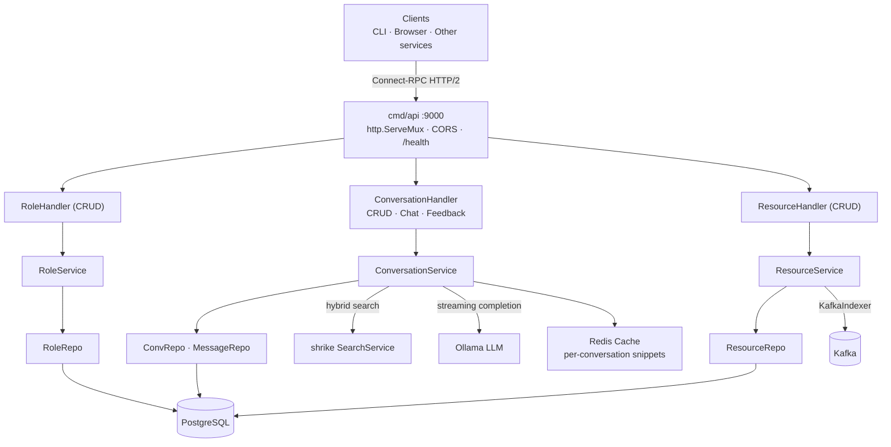
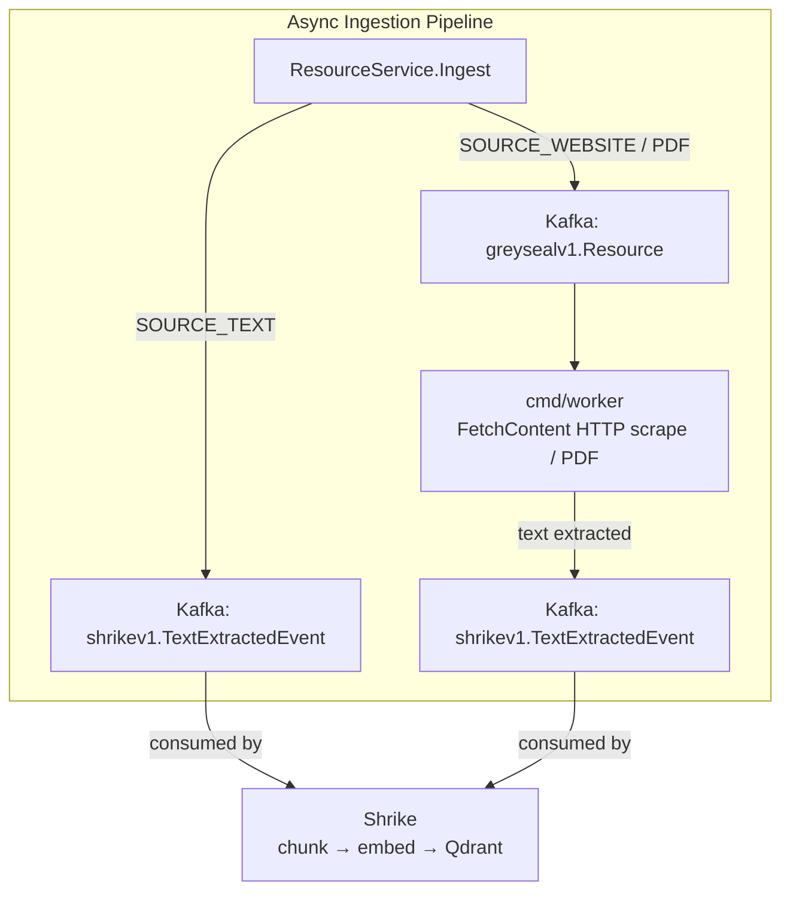

# Architecture

## System Context

```mermaid
C4Context
  title System Context — Grey Seal within joel.holmes.haus

  Person(admin, "Admin", "Manages conversations and resources; chats with the assistant")

  Boundary(platform, "joel.holmes.haus Platform") {
    System(ui, "joel.holmes.haus", "Go-app WASM admin SPA")
    System(greyseal, "Grey Seal", "RAG-powered conversation and resource management service")
    System(shrike, "Shrike", "Search — provides hybrid semantic/keyword context retrieval")
    System(magpie, "Magpie", "Resource hub — receives ingested resources from Grey Seal")
  }

  SystemDb(postgres, "PostgreSQL", "Conversations, messages, roles, resources")
  SystemDb(redis, "Redis", "Per-conversation resource snippet cache (24 h TTL)")
  SystemExternal(ollama, "Ollama", "Local LLM (deepseek-r1) — streaming chat completions")
  SystemQueue(kafka, "Kafka", "greyseal.v1.Resource (ingest queue) · shrike.v1.TextExtractedEvent")

  Rel(admin, ui, "Uses")
  Rel(ui, greyseal, "ConnectRPC")
  Rel(greyseal, postgres, "Reads / writes")
  Rel(greyseal, redis, "Resource snippet cache")
  Rel(greyseal, ollama, "Streaming LLM chat")
  Rel(greyseal, shrike, "ConnectRPC hybrid search for context")
  Rel(greyseal, kafka, "Publishes resource events · consumes async ingest")
  Rel(magpie, kafka, "Consumes greyseal resource events")
```

## Container Diagram

```mermaid
C4Container
  title Grey Seal — Internal Containers

  Boundary(greyseal, "Grey Seal") {
    Container(api, "cmd/api", "Go / ConnectRPC h2c :9000", "ConversationService · ResourceService · RoleService")
    Container(worker, "cmd/worker", "Go / Kafka", "Async content fetch — scrapes websites/PDFs, publishes TextExtractedEvent to Shrike")

    Container(convSvc, "conversation.Service", "Go", "Chat (RAG pipeline) · CRUD · SubmitFeedback · summarisation")
    Container(resourceSvc, "resource.Service", "Go", "Ingest · CRUD — triggers async indexing via KafkaIndexer")
    Container(roleSvc, "role.Service", "Go", "CRUD for system prompt roles")
    Container(cache, "RedisResourceCache", "Go / Redis", "Per-conversation snippet cache keyed greyseal:conv:{uuid}:resources")

    ContainerDb(convRepo, "ConversationRepo + MessageRepo", "PostgreSQL / squirrel", "conversations · messages tables")
    ContainerDb(resourceRepo, "ResourceRepo", "PostgreSQL / squirrel", "resources table")
  }

  SystemDb(postgres, "PostgreSQL", "")
  SystemDb(redis, "Redis", "")
  SystemExternal(ollama, "Ollama", "POST /api/chat stream")
  SystemExternal(shrike, "Shrike", "ConnectRPC SearchService")
  SystemQueue(kafka, "Kafka", "")

  Rel(api, convSvc, "Chat · CRUD")
  Rel(api, resourceSvc, "Ingest · CRUD")
  Rel(api, roleSvc, "CRUD")
  Rel(convSvc, cache, "Cache-first context lookup")
  Rel(convSvc, shrike, "Hybrid search with EntityUUIDs filter")
  Rel(convSvc, ollama, "Streaming completion")
  Rel(convSvc, convRepo, "Persist messages + summary")
  Rel(resourceSvc, resourceRepo, "CRUD")
  Rel(resourceSvc, kafka, "KafkaIndexer: TextExtractedEvent or greyseal.v1.Resource")
  Rel(worker, kafka, "Consumes greyseal.v1.Resource")
  Rel(worker, kafka, "Publishes shrike.v1.TextExtractedEvent")
  Rel(convRepo, postgres, "SQL")
  Rel(resourceRepo, postgres, "SQL")
  Rel(cache, redis, "GET / SET")
```

## Overview

grey-seal is a single-binary Go service (`cmd/api`) that exposes a Connect-RPC API over HTTP/2 (h2c). It uses a layered architecture: a thin gRPC/Connect handler layer delegates to domain service interfaces, which are backed by PostgreSQL repositories. LLM inference is delegated to a local Ollama instance; semantic search is delegated to the external **shrike** service. Resources are ingested asynchronously via **Redpanda/Kafka**: the API enqueues events that the **worker** process consumes to fetch content and forward it to shrike for chunking, embedding, and vector indexing.





## Process Inventory

| Process | Source | Port | Notes |
|---|---|---|---|
| API server | `cmd/api/main.go` | 9000 | Active, ships in `Dockerfile` |
| Worker | `cmd/worker/main.go` | — | Kafka consumer; fetches web/PDF content and forwards to shrike |
| UI | `cmd/ui/main.go` | 8000 | `//go:build ignore`; excluded from normal builds |

## Transport

The API server uses `h2c` (cleartext HTTP/2) via `golang.org/x/net/http2/h2c`, making it compatible with both native gRPC clients and the Connect-RPC `grpc-web` protocol. CORS is applied per-handler using `connectrpc.com/cors` helper headers, allowing wildcard origins.

## Domain Services

### Role service (`lib/greyseal/role/`)

Thin CRUD service around the `roles` table. No business logic beyond delegation to the repository. Exposes `List`, `Get`, `Create`, `Update`, `Delete`.

### Resource service (`lib/greyseal/resource/`)

Manages resource metadata (title, URL, source type, timestamps). Exposes `List`, `Get`, `Ingest`, `Delete`.

`Ingest` assigns a UUID and `created_at`, persists the record, then triggers async indexing via the `Indexer` interface. When `KAFKA_BROKERS` is set the real `KafkaIndexer` is wired; otherwise the indexer is `nil` and indexing is skipped (graceful degradation).

`KafkaIndexer` publishes:
- `SOURCE_TEXT` → `shrikev1.TextExtractedEvent` (topic `v1.TextExtractedEvent`) directly to shrike's consumer
- `SOURCE_WEBSITE` / `SOURCE_PDF` → `greysealv1.Resource` (topic `v1.Resource`) to the worker queue

### Conversation service (`lib/greyseal/conversation/`)

The core RAG orchestration service. Handles CRUD on conversations and the `Chat` method, which:

1. Persist the incoming user `Message`.
2. Load the `Conversation` record (`role_uuid`, `resource_uuids`, `summary`).
3. If `role_uuid` is set, fetch the `Role` and prepend its `system_prompt` as a system message.
4. Load prior message history. If history exceeds 10 messages, summarise the overflow via a second LLM call and persist the summary to `conversations.summary`. Prepend the (existing or freshly generated) summary as a system message.
5. Retrieve relevant context via `contextSearch` (cache-first): check the per-conversation `ResourceCache` first; on a miss, call **shrike** (`Searcher`) with `EntityUuids` filter, then populate the cache. Format snippets as `"N. [Title]: snippet"` for source attribution.
6. Append message history and the current user turn.
7. Call the **LLM** (`LLM` interface); stream each token via the Connect server-stream callback.
8. Persist the assistant response and update `conversations.updated_at`.

`SubmitFeedback` writes -1/0/1 to `messages.feedback`.

`ResourceCache` (`lib/repo/cache/RedisResourceCache`) stores per-conversation resource snippets in Redis (key `greyseal:conv:{uuid}:resources`, TTL 24 h). Wired when `REDIS_URL` is set; `nil` otherwise (no caching).

## Worker (`cmd/worker/`)

Consumes the `v1.Resource` Kafka topic via `archaea/kafka.Consumer`. For each resource:
1. Calls `resource.FetchContent` to retrieve the raw text (HTTP scrape for websites; placeholder for PDFs).
2. Publishes a `shrikev1.TextExtractedEvent` to shrike's Kafka topic for chunking, embedding, and Qdrant indexing.
3. Updates `resources.indexed_at` in PostgreSQL.

Requires `KAFKA_BROKERS` and `DATABASE_URL` environment variables.

## Repository Layer (`lib/repo/`)

All repositories embed `*Conn`, which holds a `*sql.DB`. SQL is built with `Masterminds/squirrel` using the `$N` placeholder format. PostgreSQL arrays (`TEXT[]`) are handled with `lib/pq.Array`. Timestamps are stored as `TIMESTAMP WITH TIME ZONE`.

`NewDatabase` runs goose migrations automatically on startup from an embedded FS (`//go:embed migrations/*.sql`).

## LLM Adapter (`lib/repo/ollama/`)

`ollama.LLM` implements `conversation.LLM`. It POSTs to Ollama's `/api/chat` endpoint with `"stream": true` and reads newline-delimited JSON chunks, invoking the provided callback per token. Configuration is via `OLLAMA_HOST` and `OLLAMA_CHAT_MODEL` environment variables (defaults: `http://localhost:11434`, `deepseek-r1`).

## Search Adapter

`shrikeSearcher` implements `conversation.Searcher` by calling `shrikeconnect.SearchServiceClient.Search` with `mode: "hybrid"` and a `SearchFilter.EntityUuids` field when the conversation is scoped to specific resources. Server-side filtering eliminates the need for a client-side loop.

## UI (`lib/ui/`, `cmd/ui/`)

All UI files carry `//go:build ignore` and are excluded from normal compilation. The UI is a WebAssembly single-page application built with `go-app` v9 (Pico CSS for styling). It exposes routes for Messages, Conversations, Resources, and Roles with full CRUD pages.

## CLI (`cmd/`)

The root Cobra command is `grey-seal`. The only active subcommand is `ingest`. The CRUD command files (`conversation_cmd.go`, `resource_cmd.go`, `role_cmd.go`) also carry `//go:build ignore` and are not compiled.

## External Dependencies (key)

| Package | Role |
|---|---|
| `connectrpc.com/connect` | Connect-RPC server and client |
| `connectrpc.com/cors` | CORS headers for Connect |
| `github.com/holmes89/archaea` | Generic base types + Kafka producer/consumer |
| `github.com/holmes89/shrike` | External vector search + text extraction service |
| `github.com/redis/go-redis/v9` | Redis client for resource snippet cache |
| `github.com/Masterminds/squirrel` | SQL query builder |
| `github.com/pressly/goose/v3` | Database migrations |
| `github.com/spf13/cobra` | CLI framework |
| `github.com/google/uuid` | UUID generation |
| `github.com/lib/pq` | PostgreSQL driver + array support |
